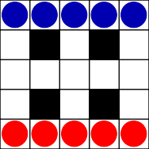

# JavaFx logikai játék az MVC modellt követve

---

## Játék leírása:
<ul>
    <li>Az ábrán látható a játék kezdőállapota.</li>
    <li>Az egyik játékos színe a kék, a másiké a piros. Felváltva
következnek lépni, amelynek során két saját színű korongot mozdítanak el
ugyanabba az irányba egy-egy nyolcszomszédos, üres mezőre, azonban a fekete
mezőkre nem lehet lépni.</li>
    <li>A játékosok célja az összes figura átjuttatása az
ellenkező oldalra.</li>
    <li>Az nyer, akinek ez hamarabb sikerül.</li>
</ul>

    

---
<ul>
    <li>Programozási nyelv: Java</li>
    <li>Verzió: 17</li>
    <li>Projektmenedzselő szoftver: <a href="https://maven.apache.org/what-is-maven.html">Apache Maven</a></li>
</ul>
